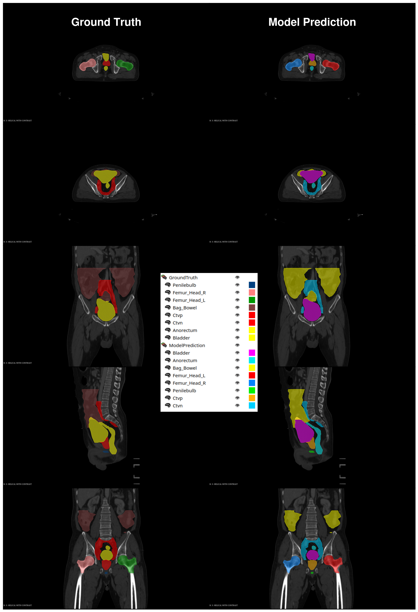

# DRAW: Autosegmentation for Radiation Therapy Planning

DRAW (Deep Radiotherapy Autosegmentation Workflow) is a comprehensive solution for automatic segmentation of organs at risk (OARs) and target volumes in radiation therapy planning. It leverages the powerful nnUNet architecture and is designed to seamlessly integrate into radiotherapy planning workflows.

## Features

- **DICOM Compatibility**: Seamlessly integrates with DICOM images, ensuring compatibility with standard medical imaging formats.
- **Structure Overlap Handling**: Deals with overlapping structures by splitting models.
- **Comprehensive Segmentation**: Predicts both organs at risk (OARs) and clinical target volumes (CTVs).
- **Multi-Site Support**: Works on multiple cancer sites, including prostate cancer patients (TSPrime) and full bladder patients (TSGyne).
- **Parallel Execution**: Supports the execution of models in parallel using multiprocessing.
- **Flexible Segmentation Options**: DRAW caters to diverse user needs by offering both automatic and manual segmentation options.
- **Database Integration**: Integrates with a database for monitoring and analyzing workflows.



## Installation

1. Clone the repository:

```
git clone https://github.com/Dutta-SD/nnunet_draw.git
```

2. Install the required dependencies:

```
pip install -r requirements.txt
```

3. Set up the environment variables by creating an `env.draw.yml` file based on the provided `template.env.draw.yml`.

## Usage

Refer to the [documentation](documentation) for details about each CLI endpoint.

## License

This project is licensed under the [Apache License 2.0](LICENSE).

## Acknowledgments

This project is built upon the nnUNet architecture and aims to provide a comprehensive solution for autosegmentation in radiation therapy planning. We would like to thank the authors of nnUNet for their valuable work.