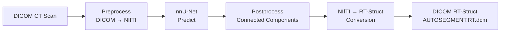

# Architecture

## Overview

DRAW is a Click-based CLI application that orchestrates an end-to-end DICOM auto-segmentation pipeline built on nnU-Net v2. The system reads DICOM CT studies, predicts organ-at-risk (OAR) and clinical target volume (CTV) segmentations for multiple cancer sites, and writes DICOM RT-Struct files for clinical treatment planning systems.

## System Diagram



## Module Structure

```
draw/
├── main.py                  # CLI entry point (Click group)
├── draw/
│   ├── config.py            # Central configuration (env, constants, model registry)
│   ├── cli/                 # CLI command definitions
│   │   ├── preprocess.py    # `preprocess` command
│   │   ├── predict.py       # `predict` command
│   │   ├── train.py         # `train-single-gpu` command
│   │   ├── pipeline.py      # `start-pipeline` command
│   │   └── impex.py         # `zip-model` command
│   ├── preprocess/          # DICOM → nnU-Net dataset conversion
│   │   └── preprocess_data.py
│   ├── predict/             # Orchestrates multi-model inference + RT-Struct output
│   │   └── predict.py
│   ├── train/               # nnU-Net planning + training + evaluation
│   │   └── train.py
│   ├── pipeline/            # Continuous prediction (watchdog + queue)
│   │   ├── start.py         # Process launcher
│   │   ├── TASK_copy.py     # Filesystem watcher (watchdog)
│   │   └── TASK_predict.py  # Prediction consumer loop
│   ├── postprocess/         # Connected-component post-processing
│   │   └── postprocess.py
│   ├── evaluate/            # nnU-Net evaluation + summary extraction
│   │   └── evaluate.py
│   ├── impex/               # Model export (ZIP archiving)
│   │   └── export.py
│   ├── accessor/            # nnU-Net v2 CLI adapter
│   │   └── nnunetv2.py
│   ├── dao/                 # Database layer (SQLAlchemy)
│   │   ├── common.py        # Engine, Base, Status/Model enums
│   │   ├── table.py         # DicomLog ORM model
│   │   └── db.py            # DBConnection (queue operations)
│   └── utils/               # Shared utilities
│       ├── dcm2nii.py       # DICOM + RT-Struct → NIfTI conversion
│       ├── nifti2rt.py      # NIfTI predictions → DICOM RT-Struct
│       ├── ioutils.py       # File I/O, DICOM helpers, GPU queries
│       ├── mapping.py       # YAML config loading + schema validation
│       ├── logging.py       # Logger factory
│       └── debounce.py      # Debounce utility
└── config_yaml/             # Cancer-site model definitions (one YAML per site)
```

## Key Design Decisions

### 1. Multi-Model Split for Overlapping Labels

DICOM RT-Struct supports overlapping segmentations; NIfTI (nnU-Net's format) does not. When two structures spatially overlap (e.g., CTVn and Bag_Bowel), a single model must drop voxels from one structure — contaminating the training signal.

DRAW solves this by training **separate nnU-Net models per non-overlapping label group** and recombining outputs into a multi-label RT-Struct. The TSPrime configuration uses three sub-models:
- Dataset 720: OARs (Bladder, Anorectum, Bag_Bowel, Femur heads, Penilebulb)
- Dataset 721: CTVp (prostate target)
- Dataset 722: CTVn (nodal target)

### 2. Parallel Multi-Model Inference

A single PlainConvUNet does not saturate the GPU on a 512³ CT volume. DRAW co-schedules label-group models on the same GPU via Python's `multiprocessing.Pool` (default 2 workers), sharing input loading. The label-group split (required for correctness) becomes the lever that fills the GPU.

Result: **~3× wall-clock speedup** vs serial execution.

### 3. Continuous Pipeline Architecture

`start-pipeline` spawns two long-lived processes:

1. **Watcher** (`TASK_copy.py`): Uses `watchdog` to monitor a DICOM directory. When a new study lands, it reads the DICOM `ProtocolName` tag, maps it to a cancer-site model via YAML config, and enqueues a `DicomLog` record.

2. **Predictor** (`TASK_predict.py`): Cycles through all configured model names, dequeues pending records, checks GPU memory, and runs inference with retry logic. After prediction, marks records as `SENT`.

State machine: `INIT → STARTED → PREDICTED → SENT`

### 4. Database as Queue

For the clinical deployment's traffic volume (300+ scans/day), a SQL database serves as both task queue and audit log. This eliminates the need for a separate message broker while providing:
- Deduplication via `series_instance_uid` uniqueness constraint
- Status tracking for operational visibility
- Historical analytics on prediction throughput

### 5. Test-Time Augmentation Disabled

nnU-Net's default TTA runs each volume 8× with negligible Dice impact on the clinical dataset. DRAW disables TTA (`--disable_tta`) for an additional **~8× speedup**.

### 6. Largest-Connected-Component Post-Processing

For paired structures (Femur_Head_L/R), cross-midline misclassification is eliminated by retaining only the largest 3D connected component per label. Femur_Head_L Dice: 0.874 → 0.895.

## Data Flow

### Preprocessing

```
Raw DICOM (CT + RT-Struct)
    │
    ▼ DicomConverters.convert_DICOM_to_Multi_NIFTI()
Binary NIfTI masks (one per structure)
    │
    ▼ combine_masks_to_multilabel_file()
Single multi-label NIfTI (nnU-Net format)
    │
    ▼ make_dataset_json_file()
nnU-Net dataset (imagesTr/ + labelsTr/ + dataset.json)
```

### Prediction

```
DICOM CT study
    │
    ▼ convert_dicom_dir_to_nnunet_dataset() [images only]
NIfTI image in nnU-Net layout
    │
    ▼ generate_labels_on_data() [parallel per label group]
NIfTI prediction masks
    │
    ▼ postprocess_folder() [optional, per config]
Post-processed NIfTI masks
    │
    ▼ convert_nifti_outputs_to_dicom()
DICOM RT-Struct file (AUTOSEGMENT.RT.dcm)
```

## Environment Variables

DRAW requires the following nnU-Net environment variables (set automatically by `NNUNetV2Adapter`):

| Variable | Default | Purpose |
|----------|---------|---------|
| `nnUNet_raw` | `data/nnUNet_raw` | Raw dataset storage |
| `nnUNet_preprocessed` | `data/nnUNet_preprocessed` | Preprocessed dataset storage |
| `nnUNet_results` | `data/nnUNet_results` | Trained model checkpoints |

These are configured via the `NNUNetV2Adapter` constructor in `draw/accessor/nnunetv2.py`.
