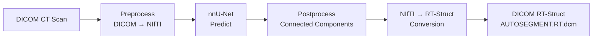
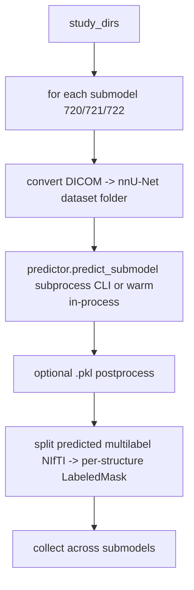
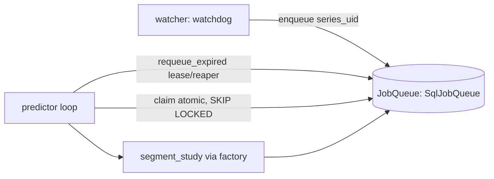

# Architecture

> **Note.** The "Module Structure" and "Data Flow" sections below describe the original
> single-package (`draw/`) layout. The system has since been refactored into a layered
> `src/` architecture with a pluggable engine. **The [Low-Level Design](#low-level-design-lld)
> section at the end is the current source of truth** for module layout, contracts, and
> control flow; the earlier sections are retained for the design rationale (the "Key
> Design Decisions" still hold).

## Overview

DRAW is a Click-based CLI application that orchestrates an end-to-end DICOM auto-segmentation pipeline built on nnU-Net v2. The system reads DICOM CT studies, predicts organ-at-risk (OAR) and clinical target volume (CTV) segmentations for multiple cancer sites, and writes DICOM RT-Struct files for clinical treatment planning systems.

## System Diagram



## Module Structure

```
draw/
├── main.py                  # CLI entry point (Click group)
├── draw/
│   ├── config.py            # Central configuration (env, constants, model registry)
│   ├── cli/                 # CLI command definitions
│   │   ├── preprocess.py    # `preprocess` command
│   │   ├── predict.py       # `predict` command
│   │   ├── train.py         # `train-single-gpu` command
│   │   ├── pipeline.py      # `start-pipeline` command
│   │   └── impex.py         # `zip-model` command
│   ├── preprocess/          # DICOM → nnU-Net dataset conversion
│   │   └── preprocess_data.py
│   ├── predict/             # Orchestrates multi-model inference + RT-Struct output
│   │   └── predict.py
│   ├── train/               # nnU-Net planning + training + evaluation
│   │   └── train.py
│   ├── pipeline/            # Continuous prediction (watchdog + queue)
│   │   ├── start.py         # Process launcher
│   │   ├── TASK_copy.py     # Filesystem watcher (watchdog)
│   │   └── TASK_predict.py  # Prediction consumer loop
│   ├── postprocess/         # Connected-component post-processing
│   │   └── postprocess.py
│   ├── evaluate/            # nnU-Net evaluation + summary extraction
│   │   └── evaluate.py
│   ├── impex/               # Model export (ZIP archiving)
│   │   └── export.py
│   ├── accessor/            # nnU-Net v2 CLI adapter
│   │   └── nnunetv2.py
│   ├── dao/                 # Database layer (SQLAlchemy)
│   │   ├── common.py        # Engine, Base, Status/Model enums
│   │   ├── table.py         # DicomLog ORM model
│   │   └── db.py            # DBConnection (queue operations)
│   └── utils/               # Shared utilities
│       ├── dcm2nii.py       # DICOM + RT-Struct → NIfTI conversion
│       ├── nifti2rt.py      # NIfTI predictions → DICOM RT-Struct
│       ├── ioutils.py       # File I/O, DICOM helpers, GPU queries
│       ├── mapping.py       # YAML config loading + schema validation
│       ├── logging.py       # Logger factory
│       └── debounce.py      # Debounce utility
└── config_yaml/             # Cancer-site model definitions (one YAML per site)
```

## Key Design Decisions

### 1. Multi-Model Split for Overlapping Labels

DICOM RT-Struct supports overlapping segmentations; NIfTI (nnU-Net's format) does not. When two structures spatially overlap (e.g., CTVn and Bag_Bowel), a single model must drop voxels from one structure — contaminating the training signal.

DRAW solves this by training **separate nnU-Net models per non-overlapping label group** and recombining outputs into a multi-label RT-Struct. The TSPrime configuration uses three sub-models:
- Dataset 720: OARs (Bladder, Anorectum, Bag_Bowel, Femur heads, Penilebulb)
- Dataset 721: CTVp (prostate target)
- Dataset 722: CTVn (nodal target)

### 2. Parallel Multi-Model Inference

A single PlainConvUNet does not saturate the GPU on a 512³ CT volume. DRAW co-schedules label-group models on the same GPU via Python's `multiprocessing.Pool` (default 2 workers), sharing input loading. The label-group split (required for correctness) becomes the lever that fills the GPU.

Result: **~3× wall-clock speedup** vs serial execution.

### 3. Continuous Pipeline Architecture

`start-pipeline` spawns two long-lived processes:

1. **Watcher** (`TASK_copy.py`): Uses `watchdog` to monitor a DICOM directory. When a new study lands, it reads the DICOM `ProtocolName` tag, maps it to a cancer-site model via YAML config, and enqueues a `DicomLog` record.

2. **Predictor** (`TASK_predict.py`): Cycles through all configured model names, dequeues pending records, checks GPU memory, and runs inference with retry logic. After prediction, marks records as `SENT`.

State machine: `INIT → STARTED → PREDICTED → SENT`

### 4. Database as Queue

For the clinical deployment's traffic volume (300+ scans/day), a SQL database serves as both task queue and audit log. This eliminates the need for a separate message broker while providing:
- Deduplication via `series_instance_uid` uniqueness constraint
- Status tracking for operational visibility
- Historical analytics on prediction throughput

### 5. Test-Time Augmentation Disabled

nnU-Net's default TTA runs each volume 8× with negligible Dice impact on the clinical dataset. DRAW disables TTA (`--disable_tta`) for an additional **~8× speedup**.

### 6. Largest-Connected-Component Post-Processing

For paired structures (Femur_Head_L/R), cross-midline misclassification is eliminated by retaining only the largest 3D connected component per label. Femur_Head_L Dice: 0.874 → 0.895.

## Data Flow

### Preprocessing

```
Raw DICOM (CT + RT-Struct)
    │
    ▼ DicomConverters.convert_DICOM_to_Multi_NIFTI()
Binary NIfTI masks (one per structure)
    │
    ▼ combine_masks_to_multilabel_file()
Single multi-label NIfTI (nnU-Net format)
    │
    ▼ make_dataset_json_file()
nnU-Net dataset (imagesTr/ + labelsTr/ + dataset.json)
```

### Prediction

```
DICOM CT study
    │
    ▼ convert_dicom_dir_to_nnunet_dataset() [images only]
NIfTI image in nnU-Net layout
    │
    ▼ generate_labels_on_data() [parallel per label group]
NIfTI prediction masks
    │
    ▼ postprocess_folder() [optional, per config]
Post-processed NIfTI masks
    │
    ▼ convert_nifti_outputs_to_dicom()
DICOM RT-Struct file (AUTOSEGMENT.RT.dcm)
```

## Environment Variables

DRAW requires the following nnU-Net environment variables (set automatically by `NNUNetV2Adapter`):

| Variable | Default | Purpose |
|----------|---------|---------|
| `nnUNet_raw` | `data/nnUNet_raw` | Raw dataset storage |
| `nnUNet_preprocessed` | `data/nnUNet_preprocessed` | Preprocessed dataset storage |
| `nnUNet_results` | `data/nnUNet_results` | Trained model checkpoints |

These are configured via the `NNUNetV2Adapter` constructor in `src/draw_core/accessor/nnunetv2.py`.

---

# Low-Level Design (LLD)

This is the current design after the refactor. The system's one external contract is:
**a DICOM series goes in, a DICOM RT-Struct comes out.** How a labeled mask is produced
in between is the concern of a *pluggable engine* (nnU-Net today; nnFormer / promptable /
remote models are drop-in). Dependencies point strictly inward.

## 1. Layered package structure (`src/`)

```
src/
├── draw_contracts/         # Pure types + Protocols. No heavy deps, no I/O at import.
│   ├── dto.py              #   SegmentationJob, SegmentationResult, SeriesResult, ModelSpec
│   ├── protocols.py        #   JobStatus, StatusSink, StorageBackend
│   ├── queue.py            #   JobQueue Protocol + QueueItem
│   └── sink.py             #   NullStatusSink
│
├── draw_core/              # Segmentation policy. Importable with no GPU / no torch.
│   ├── constants.py        #   pure constants (no env reads)
│   ├── config.py           #   CoreConfig dataclass (paths, batch size, warm/gpu_id)
│   ├── logging.py          #   get_logger / configure_logging (no import-time config)
│   ├── models.py           #   ModelConfig + ModelRegistry (generic envelope)
│   ├── sidecar.py          #   typed db.json (SampleRecord)
│   ├── segment.py          #   segment_study() — thin, ENGINE-AGNOSTIC orchestrator
│   ├── engines/            #   the pluggable seam
│   │   ├── base.py         #     SegmentationEngine + TrainableEngine Protocols, LabeledMask
│   │   ├── factory.py      #     register_engine / build_engine (lazy, discriminator-keyed)
│   │   └── nnunet.py       #     NnUNetEngine + NnUNetConfig (ALL nnU-Net specifics)
│   ├── accessor/           #   nnU-Net runtime (engine-internal): adapter, predictor, warm
│   ├── preprocess/ evaluate/ postprocess/   #   nnU-Net-internal steps
│
├── draw_conversion/        # Model-agnostic DICOM <-> NIfTI <-> RT-Struct.
│   ├── dicom_io.py         #   DICOM read helpers (series UID, RT split)
│   ├── dcm2nii.py          #   DICOM -> NIfTI
│   └── nifti2rt.py         #   masks -> RT-Struct (write_named_masks_to_rtstruct)
│
└── draw_pipeline/          # Scaffolding (may import sqlalchemy/watchdog/torch).
    ├── config.py           #   RuntimeEnv + load_env (env vars > env.draw.yml)
    ├── dao/                #   SqlJobQueue, ORM, engine factory, ensure_schema
    ├── queue_memory.py     #   InMemoryJobQueue
    ├── sinks/queue_sink.py #   QueueStatusSink (adapts JobQueue -> StatusSink)
    ├── pipeline/           #   watcher (task_copy), predictor loop (task_predict), start
    ├── migrations.py + alembic/   #   schema migrations
    ├── train.py            #   nnU-Net training driver
    └── cli/main.py         #   the `draw` console script (all commands)
```

**Dependency rule:** `draw_pipeline` → `draw_core`/`draw_conversion` → `draw_contracts`.
The core never imports the pipeline, a database, watchdog, or torch at module load
(engine-specific heavy deps are imported lazily inside the engine's call path).

## 2. The engine contract

```python
@dataclass(frozen=True)
class LabeledMask:
    series_uid: str          # source DICOM series this mask belongs to
    name: str                # clinical structure name -> becomes an RT-Struct ROI
    mask: np.ndarray         # boolean 3D array in the CT voxel grid

class SegmentationEngine(Protocol):
    name: str
    def segment(self, study_dirs: list[str], seg_map: dict[int, str],
                work_dir: str) -> list[LabeledMask]: ...

class TrainableEngine(SegmentationEngine, Protocol):   # optional capability
    def plan(self, dataset_id: str, **kwargs) -> None: ...
    def train(self, dataset_id: str, fold: str, **kwargs) -> None: ...
```

Design invariants that keep this model-agnostic:
- **`seg_map` is passed IN** — metadata for nnU-Net, *prompt source* for promptable/LLM
  engines.
- **Per-label masks come OUT** (the general shape) — a promptable model emits one mask
  per structure (possibly overlapping); a multilabel model splits its volume. The
  shared conversion layer combines them.
- **No NIfTI / folder / patch / GPU / fold / checkpoint** appears in the Protocol — all
  of that is nnU-Net detail inside `NnUNetEngine`.
- **Training is segregated** into `TrainableEngine`, so a remote/ONNX engine isn't forced
  to provide a meaningless `train()`. `train-single-gpu` checks `isinstance(engine,
  TrainableEngine)` and fails clearly otherwise.

## 3. Factory + per-engine config (config-driven plug)

Config uses a **generic envelope + opaque per-engine block**:

```yaml
name: TSPrime
protocol: prostate
engine: nnunet            # the discriminator the factory keys on
map: {1: Bladder, ...}    # generic label map (the shared conversion layer needs it)
engine_config:            # opaque to the core; NnUNetConfig parses + validates this
  models: { 720: {...}, 721: {...}, 722: {...} }
```

`build_engine(engine_name, engine_config, core_config=...)` resolves the discriminator to
a registered builder (`@register_engine("nnunet")`). Builders are imported lazily, so
selecting nnU-Net never imports MONAI/ONNX deps and vice-versa. Each engine validates its
own `engine_config` (`NnUNetConfig.from_block`), so the core schema only knows
`name / protocol / engine / map`.

**Backward compatibility:** a legacy file with no `engine` key (the existing
`config_yaml/*.yml`) is parsed as `engine: nnunet`, the whole `models` block becomes the
`engine_config`, and the union of submodel structure names becomes the generic label map.
Behaviour is unchanged.

## 4. Control flow

### Inference (`segment_study`, engine-agnostic)

```mermaid
graph TD
    A[study_dirs + ModelConfig] --> B[build_engine engine, engine_config]
    B --> C[engine.segment study_dirs, seg_map, work_dir]
    C --> D[list[LabeledMask]]
    D --> E[group masks by series_uid]
    E --> F[write_named_masks_to_rtstruct: ONE multi-label RT-Struct per study]
    F --> G[result_sink.record_predicted]
```

The grouping step is what makes the multi-submodel (overlapping-label) case correct: all
of a study's structures — across every nnU-Net submodel — land in a single RT-Struct write
(idempotent: temp file + atomic replace into a series-keyed path).

### nnU-Net engine internals (hidden behind `segment`)



`--warm` / `--gpu-id` flow into `CoreConfig` and select the warm in-process predictor
(GPU perf levers 1/2/5/8) vs the default subprocess predictor — an nnU-Net runtime detail,
invisible to the contract.

### Continuous pipeline (queue + crash recovery)



State machine: `INIT → STARTED → PREDICTED → SENT`, plus `FAILED`. `claim` is atomic; a
lease + reaper re-queues studies stranded by a killed worker; the idempotent RT-Struct
write makes reprocessing effectively-once.

## 5. Adding a new model engine

1. Implement a class satisfying `SegmentationEngine` (e.g. `NnFormerEngine`,
   `LlmSegEngine`) with its own `Config` dataclass parsing its `engine_config` block.
2. `@register_engine("nnformer")` a builder; gate heavy deps behind an optional extra
   (`draw[nnformer]`) imported lazily inside the engine.
3. Write a YAML with `engine: nnformer` and the engine's `engine_config`.

No change to `segment_study`, the pipeline, conversion, queue, or deployment. Verified by
the `test_segment_study_with_fake_engine` test (a stranger engine, no torch/GPU, produces
an RT-Struct end-to-end).

## 6. Test strategy

- **Contract tests** run against multiple backends (JobQueue: SQL + in-memory) and a
  `FakeEngine` — the same pattern proves swappability.
- **Import-safety guard** asserts the core + engines import with no env file and **no
  torch** (`tests/unit/test_import_safety.py`).
- **Output-based** assertions (DICOM in → RT-Struct out), not interaction assertions on
  stubs. GPU inference itself is validated manually on NVIDIA hardware.
