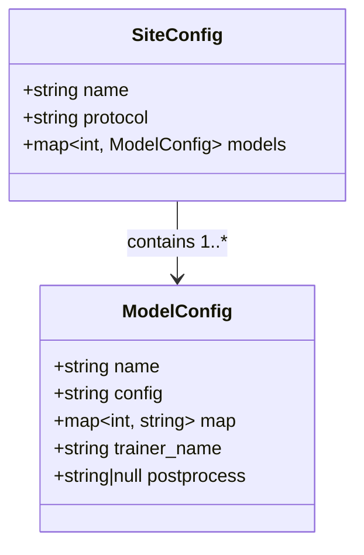
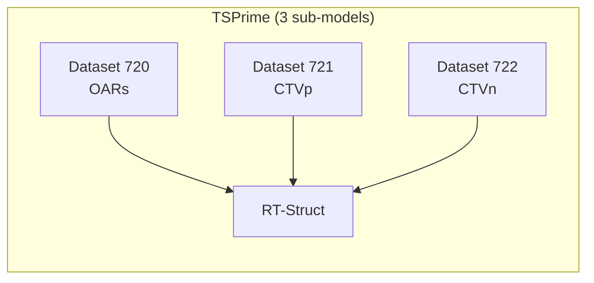

# Configuration

## Environment File (`env.draw.yml`)

DRAW reads its runtime configuration from `env.draw.yml` in the project root. Copy the template to get started:

```bash
cp template.env.draw.yml env.draw.yml
```

### Schema

```yaml
DB_URL: "sqlite:///draw.db"
DB_NAME: "draw"
TABLE_NAME: "dicomlog"
WATCH_DIR: "/path/to/dicom/inbox"
MODEL_DEF_ROOT: "config_yaml"
```

| Field | Type | Description |
|-------|------|-------------|
| `DB_URL` | string | SQLAlchemy database connection URL |
| `DB_NAME` | string | Database name |
| `TABLE_NAME` | string | Table name for the DicomLog queue |
| `WATCH_DIR` | string | Absolute path to the directory monitored by `start-pipeline` |
| `MODEL_DEF_ROOT` | string | Path to the directory containing cancer-site YAML configs |

---

## Cancer-Site Model Configuration

Each cancer site is defined by a YAML file in `config_yaml/`. Adding a new cancer site is a config change, not a code change.

### Schema



### Fields

| Field | Type | Description |
|-------|------|-------------|
| `name` | string | Unique identifier for the cancer site (e.g., `TSPrime`) |
| `protocol` | string | DICOM `ProtocolName` substring used to auto-route studies in pipeline mode |
| `models` | map | Dictionary of sub-models keyed by dataset ID (integer > 10) |

Each sub-model:

| Field | Type | Description |
|-------|------|-------------|
| `name` | string | Dataset name used in directory naming (`Dataset{id}_{name}`) |
| `config` | string | nnU-Net configuration: `3d_fullres`, `3d_lowres`, `3d_cascade_fullres` |
| `map` | map | Label index → structure name mapping (e.g., `1: Bladder`) |
| `trainer_name` | string | nnU-Net trainer class (e.g., `nnUNetTrainer`, `nnUNetTrainerNoMirroring`) |
| `postprocess` | string or null | Path to `postprocessing.pkl` file, or `null` to skip |

### Example: Prostate (`ts_prime.yml`)

```yaml
name: TSPrime
protocol: prostate
models:
  720:
    name: TSPrime
    config: 3d_fullres
    map:
      1: Bladder
      2: Anorectum
      3: Bag_Bowel
      4: Femur_Head_L
      5: Femur_Head_R
      6: Penilebulb
    trainer_name: nnUNetTrainerNoMirroring
    postprocess: data/nnUNet_results/Dataset720_TSPrime/nnUNetTrainerNoMirroring__nnUNetPlans__3d_fullres/postprocessing.pkl
  721:
    name: TSPrimeCTVP
    config: 3d_lowres
    map:
      1: Ctvp
    trainer_name: nnUNetTrainer
    postprocess: null
  722:
    name: TSPrimeCTVN
    config: 3d_fullres
    map:
      1: Ctvn
    trainer_name: nnUNetTrainer
    postprocess: null
```

### Why Multiple Sub-Models?

DICOM RT-Struct supports spatially overlapping structures, but nnU-Net's NIfTI label format does not (each voxel has exactly one integer label). When structures overlap anatomically (e.g., CTVn routinely overlaps with Bag_Bowel), a single-model approach forces the loss of one structure's voxels at the boundary.

DRAW's solution: split structures into **non-overlapping label groups**, train a separate model per group, and recombine into a single RT-Struct at output. This preserves clinical correctness at the cost of managing multiple models per site.



### Adding a New Cancer Site

1. Copy `config_yaml/template.yml` to `config_yaml/your_site.yml`
2. Define `name`, `protocol`, and `models` with non-overlapping label groups
3. Assign unique dataset IDs (> 10, not colliding with existing)
4. Place training data and run `preprocess` → `train-single-gpu` for each sub-model
5. Update `postprocess` field with the path to the generated `.pkl` file (or leave `null`)

No code changes needed. On next startup, DRAW auto-discovers all `.yml` files in `MODEL_DEF_ROOT`.

---

## Constants (`draw/config.py`)

Tunable constants for pipeline behavior:

| Constant | Default | Description |
|----------|---------|-------------|
| `PRED_BATCH_SIZE` | 1 | Records dequeued per prediction cycle |
| `PREDICTION_COOLDOWN_SECS` | 30 | Delay between dequeue and prediction (allows file copy to settle) |
| `GPU_RECHECK_TIME_SECONDS` | 10 | Sleep interval when GPU memory is insufficient |
| `GPU_FREE_GB` | 5 | Minimum free GPU memory (GB) required to start inference |
| `MULTIPROCESSING_NUM_POOL_WORKERS` | 2 | Parallel nnU-Net inference workers |
| `SAMPLE_NUMBER_ZFILL` | 3 | Zero-padding width for sample numbering (e.g., `seg_007`) |
| `RT_DEFAULT_FILE_NAME` | `AUTOSEGMENT.RT.dcm` | Output RT-Struct filename |
