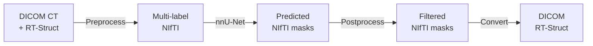
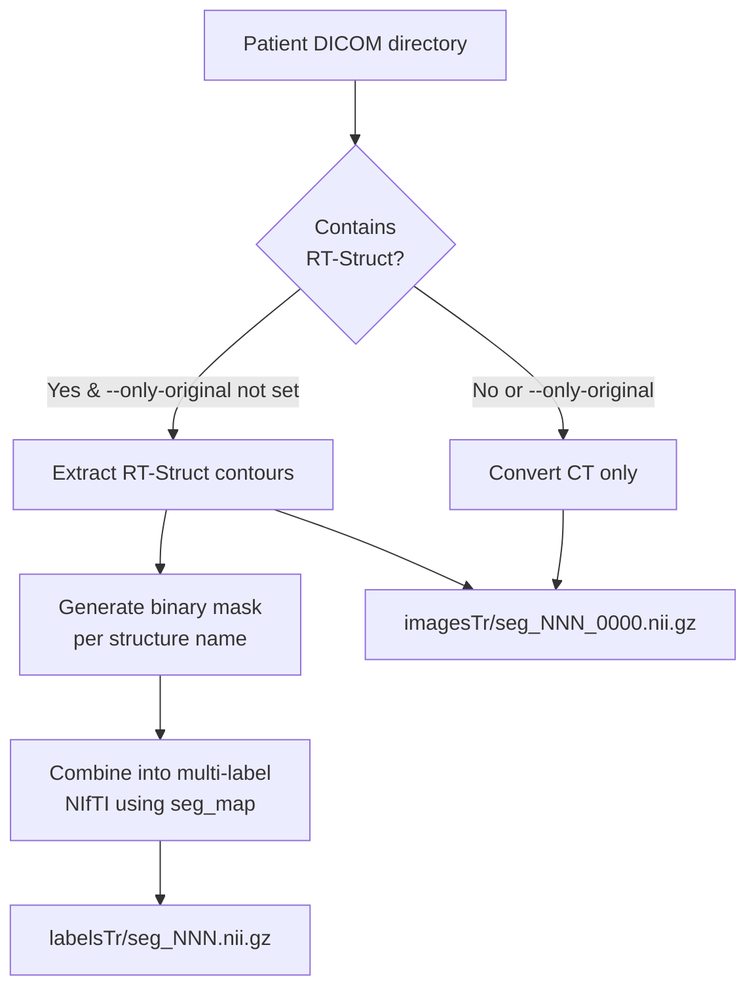
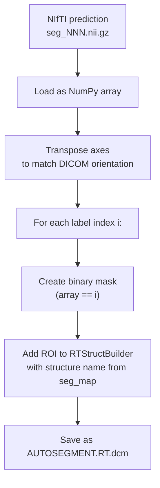
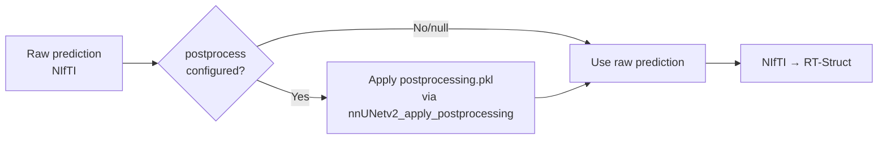

# Data Flow & Format Conversions

## Overview

DRAW bridges the gap between clinical DICOM formats and nnU-Net's research NIfTI format. Data flows through multiple conversions:



## Format Details

### DICOM CT
- Standard medical imaging format
- One `.dcm` file per axial slice
- Contains pixel data + patient/study/series metadata
- Key tags used by DRAW:
  - `(0008,0060)` Modality — to identify RT-Struct files
  - `(0020,000E)` SeriesInstanceUID — for deduplication
  - `ProtocolName` — for cancer-site routing

### DICOM RT-Struct
- Contains contour definitions for anatomical structures
- Supports **overlapping** structures (critical for CTV/OAR boundaries)
- One file per study, referencing the CT series

### NIfTI (nnU-Net format)
- 3D volumetric array stored as `.nii.gz`
- Images: `seg_NNN_0000.nii.gz` (single-channel CT)
- Labels: `seg_NNN.nii.gz` (integer mask, one value per structure)
- Does **not** support overlapping labels (each voxel = 1 integer)

## Preprocessing: DICOM → NIfTI



### Multi-Label Combination

When combining binary masks into a single multi-label file, each structure gets an integer value from the YAML `map`:

```
map:
  1: Bladder       →  voxels where Bladder mask > 0.5 → value 1
  2: Anorectum     →  voxels where Anorectum mask > 0.5 → value 2
  3: Bag_Bowel     →  voxels where Bag_Bowel mask > 0.5 → value 3
  ...
```

If a structure's mask file doesn't exist in the extracted contours, DRAW generates a zero-filled mask and logs a warning. This prevents preprocessing from crashing on incomplete annotations.

### Sample Numbering

Samples are numbered sequentially with zero-padding:
- Width: 3 digits (configurable via `SAMPLE_NUMBER_ZFILL`)
- Format: `seg_000`, `seg_001`, ..., `seg_047`
- The `--start` flag offsets numbering for incremental additions

### db.json Mapping

During preprocessing, DRAW records the mapping from nnU-Net sample numbers back to original DICOM paths:

```json
[
  {"DatasetID": 720, "SampleNumber": "000", "DICOMRootDir": "/data/raw/patient_001/CT"},
  {"DatasetID": 720, "SampleNumber": "001", "DICOMRootDir": "/data/raw/patient_002/CT"}
]
```

This mapping is essential for the prediction phase, where NIfTI outputs must be converted back to RT-Struct files referencing the correct DICOM series.

## Prediction: NIfTI → DICOM RT-Struct



### RT-Struct Construction

DRAW uses [`rt_utils`](https://github.com/qurit/rt-utils) to build RT-Struct files:

1. If an existing RT-Struct exists at the output path → load and append ROIs
2. Otherwise → create a new RT-Struct referencing the original CT DICOM series
3. For each label in the seg_map: extract binary mask, add as named ROI
4. Save to `AUTOSEGMENT.RT.dcm`

### Axis Transposition

NIfTI and DICOM use different axis conventions. The mask undergoes:

```python
np_mask = np.transpose(np_mask, [1, 0, 2])  # (Z,Y,X) NIfTI → (Y,Z,X) DICOM
```

This ensures the contours align with the original CT slices when loaded in a treatment planning system.

## Post-Processing

Between prediction and RT-Struct conversion, optional post-processing applies connected-component filtering:



The `postprocessing.pkl` file (generated during training with `--determine-postprocessing`) encodes per-label rules like "keep only the largest connected component." This eliminates small spurious predictions (e.g., Femur_Head_L fragments appearing on the right side).

## Directory Layout After Full Pipeline Run

```
data/
├── nnUNet_raw/
│   └── Dataset720_TSPrime/
│       ├── imagesTr/          # CT volumes as NIfTI
│       ├── labelsTr/          # Ground truth multi-label NIfTI
│       ├── dataset.json       # nnU-Net metadata
│       └── db.json            # Sample → DICOM path mapping
├── nnUNet_preprocessed/
│   └── Dataset720_TSPrime/
│       ├── nnUNetPlans.json   # Auto-generated training plan
│       └── gt_segmentations/  # Ground truth (for evaluation)
└── nnUNet_results/
    └── Dataset720_TSPrime/
        └── nnUNetTrainerNoMirroring__nnUNetPlans__3d_fullres/
            ├── fold_0/
            │   ├── checkpoint_best.pth
            │   └── validation/
            ├── dataset.json
            ├── plans.json
            └── postprocessing.pkl
```
