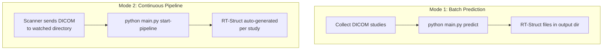
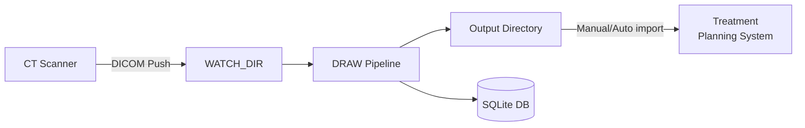
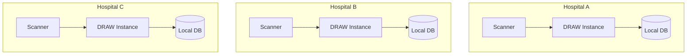

# Deployment

## Deployment Modes

DRAW supports two deployment modes:



| Mode | Command | Use Case |
|------|---------|----------|
| Batch | `predict` | Research evaluation, retrospective studies |
| Continuous | `start-pipeline` | Clinical deployment, real-time auto-segmentation |

## Single-Machine Deployment (Clinical Workstation)

This is the deployment model at Tata Medical Centre.



### Requirements

- NVIDIA GPU (T1000 8GB or better)
- 32 GB RAM
- Network share or DICOM receiver pointed at `WATCH_DIR`
- Python 3.8+ environment with DRAW installed

### Setup

1. Install DRAW (see [installation.md](installation.md))
2. Configure `env.draw.yml` with local paths
3. Place trained model ZIPs in `data/nnUNet_results/` and extract
4. Start the pipeline:
   ```bash
   python main.py start-pipeline
   ```

### Specs (Production Reference)

| Component | Tata Medical Centre |
|-----------|---------------------|
| CPU | Intel i7-12700K |
| GPU | NVIDIA Quadro T1000 8GB |
| RAM | 32 GB |
| OS | Ubuntu 22.04 |
| Database | SQLite |
| Throughput | 300+ scans/day |
| Latency | ~15 min/case |

## Multi-Hospital Deployment

For deployments across multiple hospitals:



Each hospital runs an independent DRAW instance with:
- Local GPU for inference
- Local database for queue management
- Site-specific YAML configs (different hospitals may support different cancer sites)

## Model Versioning

When updating models in production:

1. Train new model and export as ZIP
2. Stop the pipeline: `Ctrl+C` or `systemctl stop draw`
3. Back up existing model:
   ```bash
   mv data/nnUNet_results/Dataset720_TSPrime data/nnUNet_results/Dataset720_TSPrime.bak
   ```
4. Extract new model:
   ```bash
   unzip Dataset720_TSPrime_v2.zip -d data/nnUNet_results/
   ```
5. Update `postprocess` path in YAML if the `.pkl` file changed
6. Restart the pipeline

## Troubleshooting

### Pipeline not processing studies

1. Check watcher is running: look for `Started watching <path> for modifications` in logs
2. Verify `ProtocolName` matches: read a DICOM file and check the protocol string matches the YAML `protocol` field (case-insensitive substring)
3. Check database: `SELECT * FROM dicomlog ORDER BY created_on DESC LIMIT 5`
4. Check GPU memory: `nvidia-smi` — needs ≥5 GB free

### Studies stuck in STARTED state

The prediction likely crashed. Check logs for:
- CUDA out-of-memory errors → reduce parallel workers or increase `GPU_FREE_GB` threshold
- File permission errors → verify `WATCH_DIR` and output paths are writable
- nnU-Net errors → verify model files exist at expected paths

Manual reset:
```sql
UPDATE dicomlog SET status = 'INIT' WHERE status = 'STARTED';
```

### RT-Struct not loading in TPS

- Verify the RT-Struct references the correct CT SeriesInstanceUID
- Check axis orientation: the NIfTI → DICOM transpose must match scanner convention
- Some TPS require specific DICOM conformance — check `AUTOSEGMENT.RT.dcm` with a DICOM validator

### High latency

- Ensure TTA is disabled (default in DRAW)
- Check `MULTIPROCESSING_NUM_POOL_WORKERS` — set to number of sub-models in your config (e.g., 3 for TSPrime)
- Monitor GPU utilization: if < 80%, the pipeline may be I/O bound (move data to SSD)
