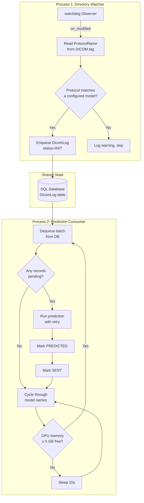
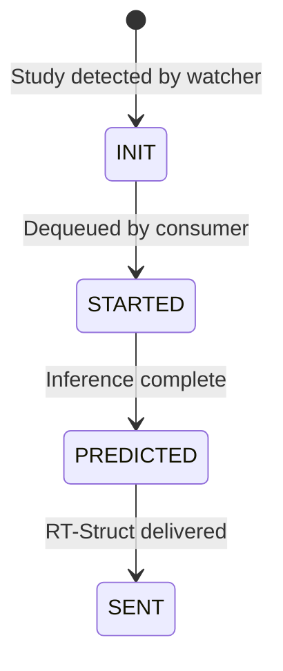

# Continuous Prediction Pipeline

## Overview

The `start-pipeline` command runs DRAW as a long-lived service for clinical deployment. It watches a directory for incoming DICOM CT studies, automatically determines the cancer site from DICOM metadata, runs multi-model inference, and writes DICOM RT-Struct files back for the treatment planning system.

This mode powers the clinical deployment at Tata Medical Centre, processing 300+ CT scans per day.

## Process Architecture



## State Machine

Each DICOM study progresses through the following states:



| State | Meaning |
|-------|---------|
| `INIT` | Study registered in queue, awaiting prediction |
| `STARTED` | Prediction in progress |
| `PREDICTED` | NIfTI → RT-Struct conversion complete |
| `SENT` | RT-Struct file delivered to output |

## Deduplication

The watcher deduplicates incoming studies using the DICOM `SeriesInstanceUID` tag. If a study with the same UID already exists in the database, the duplicate filesystem event is silently dropped. This handles:

- Watchdog emitting multiple events during a multi-file DICOM copy
- Studies being re-sent from the scanner

## File Copy Detection

When a DICOM study lands in the watched directory, files may still be streaming from the scanner. DRAW waits for the directory size to stabilize:

```python
while old_size != os.path.getsize(filename):
    old_size = os.path.getsize(filename)
    time.sleep(20)  # COPY_WAIT_SECONDS
```

Only after two consecutive 20-second checks show no size change does processing begin.

## Protocol-Based Routing

The watcher reads the `ProtocolName` DICOM tag from the first `.dcm` file found in the study directory. It performs a case-insensitive substring match against the `protocol` field in each YAML config:

```mermaid
graph LR
    D[DICOM ProtocolName:<br>"CT PROSTATE PLANNING"] --> M{Substring match}
    M -->|contains 'prostate'| T[TSPrime]
    M -->|contains 'breast'| B[TSBreast]
    M -->|contains 'head'| H[TSHeadNeck]
    M -->|no match| X[Skip study]
```

## Retry Logic

Predictions are retried on failure:

- **Attempts**: 2
- **Delay between retries**: 30 seconds
- **On final failure**: Exception logged, study remains in `STARTED` state (manual intervention required)

## GPU Memory Management

Before each prediction cycle, the consumer queries GPU memory via `nvidia-smi`:

```bash
nvidia-smi --query-gpu=memory.free --format=csv
```

If free memory is below the threshold (default 5 GB = 5120 MB), the consumer sleeps for 10 seconds before retrying. This prevents OOM crashes when other processes are using the GPU.

## Running in Production

### As a systemd service

```ini
[Unit]
Description=DRAW Autosegmentation Pipeline
After=network.target postgresql.service

[Service]
Type=simple
User=draw
WorkingDirectory=/opt/draw
ExecStart=/opt/draw/venv/bin/python main.py start-pipeline
Restart=always
RestartSec=30
Environment="CUDA_VISIBLE_DEVICES=0"

[Install]
WantedBy=multi-user.target
```

### With screen (clinical workstation)

```bash
screen -S draw
python main.py start-pipeline
# Ctrl+A, D to detach
```

### Monitoring

- Check database for stuck records: `SELECT * FROM dicomlog WHERE status = 'STARTED' AND created_on < NOW() - INTERVAL '1 hour'`
- Watch logs for `GPU memory` warnings (indicates contention)
- Monitor output directory for new `AUTOSEGMENT.RT.dcm` files
