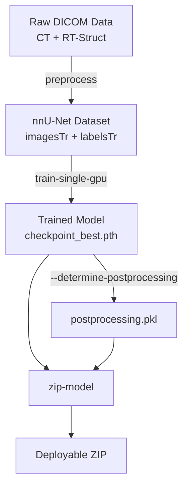

# Training Guide

## End-to-End Training Workflow



## Step 1: Prepare Raw Data

Organize your DICOM data with one patient per subdirectory:

```
/data/raw/prostate_training/
├── patient_001/          # Contains CT .dcm files + RTSTRUCT .dcm
├── patient_002/
├── patient_003/
└── ...
```

Each patient directory must contain:
- CT series DICOM files (one `.dcm` per slice)
- An RT-Struct DICOM file with structure contours matching the names in your YAML config

## Step 2: Preprocess

Convert DICOM data to nnU-Net format. Run once per sub-model in your cancer-site config.

```bash
# Prostate OARs (Dataset 720)
python main.py preprocess \
    -d /data/raw/prostate_training/ \
    -i 720 \
    -n TSPrime

# Prostate CTVp (Dataset 721)
python main.py preprocess \
    -d /data/raw/prostate_training/ \
    -i 721 \
    -n TSPrime

# Prostate CTVn (Dataset 722)
python main.py preprocess \
    -d /data/raw/prostate_training/ \
    -i 722 \
    -n TSPrime
```

Each command creates:
```
data/nnUNet_raw/Dataset720_TSPrime/
├── imagesTr/seg_000_0000.nii.gz, seg_001_0000.nii.gz, ...
├── labelsTr/seg_000.nii.gz, seg_001.nii.gz, ...
├── dataset.json
└── db.json
```

The label NIfTI files contain multi-label integer masks where each integer maps to a structure name as defined in the YAML `map` field.

## Step 3: Train

```bash
python main.py train-single-gpu \
    --model-name TSPrime \
    --dataset-id 720 \
    --model-fold 0 \
    --gpu-id 0 \
    --determine-postprocessing
```

This runs three phases:

### Phase 1: Planning

Runs `nnUNetv2_plan_and_preprocess`:
- Analyzes dataset statistics (spacing, sizes, intensity)
- Determines optimal patch size and batch size for available GPU memory
- Preprocesses and resamples all training images

### Phase 2: Training

Runs `nnUNetv2_train`:
- Trains a PlainConvUNet (or ResEncUNet) for 1000 epochs
- Uses 5-fold cross-validation (train on 4 folds, validate on 1)
- Saves `checkpoint_best.pth` (best validation Dice) and `checkpoint_final.pth`

Training time depends on dataset size and GPU:
- GTX 1080 Ti (11 GB): ~24–48 hours per fold
- RTX 3090 (24 GB): ~12–24 hours per fold

### Phase 3: Post-Processing (Optional)

If `--determine-postprocessing` is set:
1. Evaluates validation predictions against ground truth
2. Determines whether connected-component filtering improves Dice per label
3. Saves `postprocessing.pkl` to the results directory

This `.pkl` file is referenced in the YAML config's `postprocess` field.

## Step 4: Train All Folds (Optional)

For production models, train all 5 folds:

```bash
for fold in 0 1 2 3 4; do
    python main.py train-single-gpu \
        --model-name TSPrime \
        --dataset-id 720 \
        --model-fold $fold \
        --gpu-id 0
done
```

## Step 5: Export for Deployment

```bash
python main.py zip-model --dataset-id 720 --model-name TSPrime
python main.py zip-model --dataset-id 721 --model-name TSPrime
python main.py zip-model --dataset-id 722 --model-name TSPrime
```

Transfer ZIP files to the deployment machine and extract into `data/nnUNet_results/`.

## Training on Cloud (Paperspace / AWS)

### Setup

1. Create a GPU instance (P5000 / V100 / A100)
2. Upload your data as a ZIP:
   ```bash
   zip -r draw_training.zip draw/
   # Upload via cloud provider's file browser or scp
   ```
3. Extract and install on the remote machine:
   ```bash
   unzip draw_training.zip
   cd draw
   pip install -r requirements.txt
   ```
4. Verify GPU:
   ```python
   import torch
   assert torch.cuda.is_available()
   ```

### Run in Background

Use `screen` to persist training across SSH disconnects:

```bash
screen -S train_720
python main.py train-single-gpu \
    --model-name TSPrime \
    --dataset-id 720 \
    --model-fold 0 \
    --determine-postprocessing
# Ctrl+A, D to detach
```

### Monitor

Check training logs:
```bash
ls data/nnUNet_results/Dataset720_TSPrime/nnUNetTrainerNoMirroring__nnUNetPlans__3d_fullres/fold_0/
# Look for: progress.png, training_log_*.txt
```

### Download Trained Model

```bash
python main.py zip-model --dataset-id 720 --model-name TSPrime
scp Dataset720_TSPrime.zip user@local:/path/to/deployment/
```

## Trainer Options

| Trainer | Use Case |
|---------|----------|
| `nnUNetTrainer` | Default. Includes mirroring augmentation. |
| `nnUNetTrainerNoMirroring` | Disables mirror augmentation. Better for asymmetric paired structures (Femur L/R). |
| Custom trainers | Define in [Dutta-SD/nnunet_draw](https://github.com/Dutta-SD/nnunet_draw) |

## Resuming Interrupted Training

If training is interrupted (OOM, SSH disconnect, power failure):

```bash
python main.py train-single-gpu \
    --model-name TSPrime \
    --dataset-id 720 \
    --model-fold 0 \
    --train-continue
```

This resumes from the last saved checkpoint.
